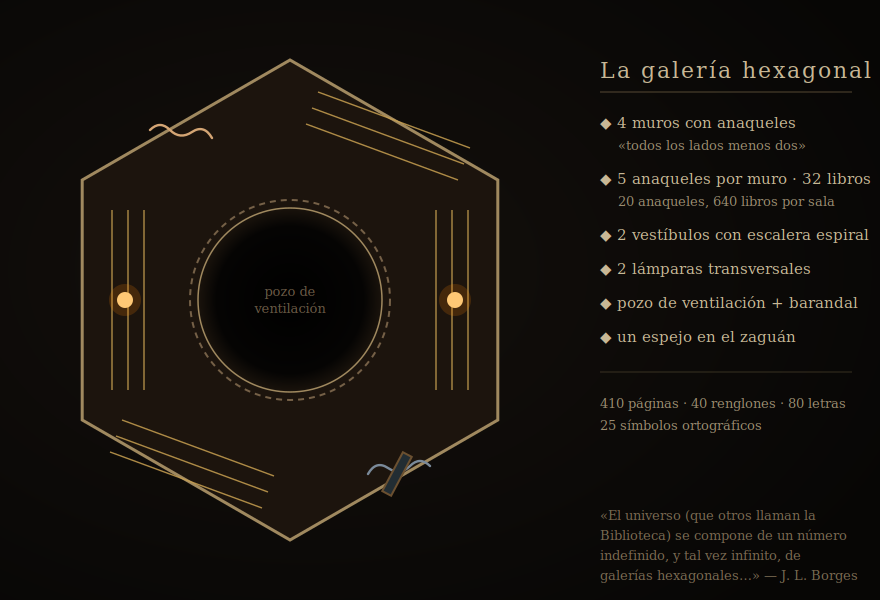

# La Biblioteca de Babel — Three.js

Exploración 3D en primera persona de *La Biblioteca de Babel* de **Jorge Luis Borges**.

> «El universo (que otros llaman la Biblioteca) se compone de un número indefinido, y tal vez infinito, de galerías hexagonales, con vastos pozos de ventilación en el medio, cercados por barandas bajísimas…»



*Plano esquemático de una galería, fiel a la arquitectura del cuento.*

## Características

- **Galerías hexagonales canónicas**: 4 muros con anaqueles (los otros dos, libres
  para los zaguanes), pozo de ventilación central y baranda bajísima.
- **Estantería fiel al texto**: 5 anaqueles por muro y **32 libros por anaquel**
  (640 libros por sala), renderizados con `InstancedMesh` — un solo *draw call*
  por muro permite la densidad canónica sin sacrificar fluidez.
- **Lomos con el alfabeto de 25 símbolos** (22 letras + espacio, punto y coma):
  los caracteres del cuento con que se escriben «todas las combinaciones posibles».
- **Dos lámparas transversales por hexágono**, de luz «insuficiente, incesante»,
  con parpadeo orgánico simulado.
- **Espejo en el zaguán** que «fielmente duplica las apariencias».
- **Escaleras de caracol** funcionales entre pisos (subir/bajar), que «se abisman
  y se elevan hacia lo remoto».
- **Niebla volumétrica** para la sensación de profundidad infinita.
- **Control en primera persona** con WASD, ratón, salto y carrera.
- **Renderizado eficiente**: LOD progresivo + frustum culling vertical + pool de
  pisos reciclables + instancing de libros. 13 pisos visibles (6 arriba, 6 abajo
  + central).
- **HUD borgiano**: piso, coordenadas axiales, FPS, aviso de escaleras,
  epígrafe inicial e inscripciones rotatorias con frases del cuento.

## Fidelidad al texto

Las cifras del mundo provienen literalmente del cuento (1941) y están fijadas en
`src/constants.js` y cubiertas por tests (`constants.test.js`):

| Detalle | Texto de Borges | Constante |
|---|---|---|
| 5 anaqueles por lado | «a cinco largos anaqueles por lado» | `NUM_SHELVES_PER_WALL = 5` |
| 4 muros con anaqueles | «cubren todos los lados menos dos» | `SHELVED_WALLS = 4` |
| 20 anaqueles por sala | «Veinte anaqueles» | `SHELVES_PER_HEX = 20` |
| 32 libros por anaquel | «treinta y dos libros de formato uniforme» | `BOOKS_PER_SHELF = 32` |
| 410 páginas / 40 renglones / 80 letras | «cada libro es de cuatrocientas diez páginas…» | `PAGES_PER_BOOK`, `LINES_PER_PAGE`, `LETTERS_PER_LINE` |
| 25 símbolos ortográficos | «el espacio, el punto, la coma, las veintidós letras» | `ALPHABET` (25) |
| 2 lámparas por hexágono | «Hay dos en cada hexágono: transversales» | `LAMPS_PER_HEX = 2` |
| Espejo en el zaguán | «un espejo, que fielmente duplica las apariencias» | `addVestibuleMirror` |

## Controles

| Tecla   | Acción            |
|---------|-------------------|
| Click   | Pointer Lock      |
| WASD    | Moverse           |
| Ratón   | Mirar             |
| Shift   | Correr            |
| Espacio | Saltar            |
| ESC     | Liberar cursor    |

## Requisitos

- Node.js >= 18
- Navegador moderno con WebGL (Chrome, Firefox, Edge)

## Instalar y ejecutar

```bash
# Instalar dependencias
npm install

# Desarrollo (con hot-reload)
npm run dev

# Build producción
npm run build

# Preview del build
npm run preview
```

Abrir `http://localhost:5173`.

## Tests

```bash
# Ejecutar suite completa
npm test

# Modo watch (desarrollo)
npm run test:watch
```

La suite cubre: validación y **fidelidad canónica** de constantes, coordenadas
hexagonales axiales, geometría de libros, estantería instanciada, escaleras de
caracol y salas hexagonales (incluyendo lámparas y espejo). **59 tests** en total.

## Estructura del proyecto

```
src/
├── main.js          # Entry point: escena, render loop, init
├── camera.js        # FPSCamera: controles de primera persona
├── geometry.js      # Coordenadas axiales, grid y anillos hexagonales
├── hexagon.js       # Geometría de salas (muros, estantes, vestíbulo, espejo)
├── floorpool.js     # Pool de pisos con LOD y frustum culling vertical
├── book.js          # Libro detallado + textura de lomo con glifos del alfabeto
├── bookshelf.js     # Muro de libros instanciado (32 por anaquel)
├── staircase.js     # Escaleras de caracol
├── lamp.js          # Dos lámparas transversales con parpadeo
├── hud.js           # HUD borgiano + epígrafe e inscripciones
├── constants.js     # Parámetros del mundo (cifras canónicas del cuento)
└── __tests__/       # Suite de tests (Vitest)
docs/
└── library-diagram.svg  # Plano esquemático de la galería hexagonal
```

## Arquitectura

### Coordenadas hexagonales axiales

El mundo usa un sistema de coordenadas axiales (q, r) para posicionar
hexágonos, con conversión a cartesianas (x, z) para Three.js.

- `hexToWorld(q, r)` → `{ x, z }`
- `worldToHex(x, z)` → `{ q, r }`
- `createHexGrid(radius)` → `[{ q, r }]`
- `createHexRoom(x, z, y, withLights, lod)` → grupo 3D completo

### Estantería instanciada

`bookshelf.js` puebla cada muro con sus 5 anaqueles × 32 libros = 160 libros
mediante un único `InstancedMesh`. Sin instancing, una sola sala a LOD 0 son 640
libros, y las decenas de salas visibles harían inviable el framerate. Con
instancing, cada muro es **un solo draw call**: el mundo respeta la cifra
canónica (más de 22 000 libros visibles simultáneamente) sin perder fluidez.
Cada libro recibe color de lomo, altura e inclinación deterministas por instancia.

### FloorPool y LOD progresivo

`FloorPool` (en `floorpool.js`) es el gestor de pisos. Crea 13 pisos al inicio
(6 arriba + 6 abajo + central), cada uno renderizado con LOD según su distancia:

| Distancia | LOD | Detalle |
|-----------|-----|---------|
| ⎮dy⎮ ≤ 2  | 0   | Completo: paredes, estantes, libros, baranda, lámparas, espejo |
| ⎮dy⎮ ≤ 4  | 1   | Medio: estantes vacíos, sin libros |
| ⎮dy⎮ ≤ 6  | 2   | Bajo: solo paredes lisas y piso |

En cada frame, `FloorPool.updateVisibility()` aplica **frustum culling vertical**:
los pisos fuera del cono de visión de la cámara se ocultan en lugar de renderizar.
El pool pre-asigna grupos en el constructor — nunca se crean o destruyen grupos
durante el gameplay, solo se reciclan con diferentes LOD según la posición del jugador.

### Pisos infinitos

La escena renderiza `VISIBLE_FLOORS` (6) pisos arriba y abajo del jugador, más el
piso central (13 en total). Al subir/bajar por una escalera, la cámara se mueve
al piso siguiente y el pool ajusta visibilidad y LOD según la nueva distancia.

## Parámetros configurables

Ver `src/constants.js`. Las cifras marcadas «canónicas» provienen del cuento y no
deben alterarse sin romper la fidelidad (los tests lo verifican).

| Constante             | Default | Descripción                           |
|-----------------------|---------|---------------------------------------|
| `HEX_RADIUS`          | 5       | Radio del hexágono (centro a vértice) |
| `HEX_HEIGHT`          | 6       | Altura del hexágono (piso a techo)    |
| `CENTER_HOLE_RADIUS`  | 2       | Radio del pozo de ventilación         |
| `NUM_SHELVES_PER_WALL`| 5       | Anaqueles por muro *(canónico)*       |
| `BOOKS_PER_SHELF`     | 32      | Libros por anaquel *(canónico)*       |
| `LAMPS_PER_HEX`       | 2       | Lámparas por hexágono *(canónico)*    |
| `VISIBLE_FLOORS`      | 6       | Pisos visibles arriba/abajo (13 total)|
| `LOD_FULL_DIST`       | 2       | Distancia para LOD completo (con libros)  |
| `LOD_MEDIUM_DIST`     | 4       | Distancia para LOD medio (sin libros)     |
| `LOD_LOW_DIST`        | 6       | Distancia para LOD bajo (solo estructura) |
| `MOVE_SPEED`          | 5       | Velocidad de movimiento               |
| `MOUSE_SENSITIVITY`   | 0.002   | Sensibilidad del ratón                |

## Limitaciones conocidas y trabajo futuro

El mundo es hoy una **ventana de 13 pisos centrada en el origen** y un racimo de
7 hexágonos (`GRID_RADIUS = 1`). De ello se derivan dos límites de la ilusión de
infinitud, documentados aquí con honestidad:

- **Eje vertical.** El LOD de cada piso se fija al construir, relativo al piso 0,
  y solo existen geometrías para los pisos −6…+6. Subir hasta el extremo superior
  o descender por debajo del piso 0 alcanza el borde del mundo construido (el
  *clamp* de gravedad ancla el suelo al piso 0). La biblioteca de Borges es
  interminable en ambos sentidos; lograrlo aquí requiere **recentrar el pool en
  el jugador** (todas las galerías son idénticas, así que basta reposicionar la
  pila de pisos y actualizar los triggers de escalera) y **colisión por piso**
  en `camera.js` en lugar del *clamp* fijo.
- **Eje horizontal.** El racimo de 7 hexágonos tiene borde; la niebla lo oculta,
  pero alejarse lo suficiente sale del mundo. Una rejilla infinita pediría un
  pool horizontal análogo al vertical.

Estas mejoras se dejaron fuera de esta iteración por requerir validación en
navegador de la mecánica de escaleras/gravedad, no cubrible por la suite de tests.

## Inspiración

Basado en el cuento *La Biblioteca de Babel* (1941) de Jorge Luis Borges.
La adaptación visual busca capturar la atmósfera del relato: galerías
hexagonales idénticas e infinitas, luz de lámparas de aceite, y libros
que contienen todas las combinaciones posibles de un alfabeto de 25 símbolos.

## Licencia

MIT — ver [LICENSE](./LICENSE).
